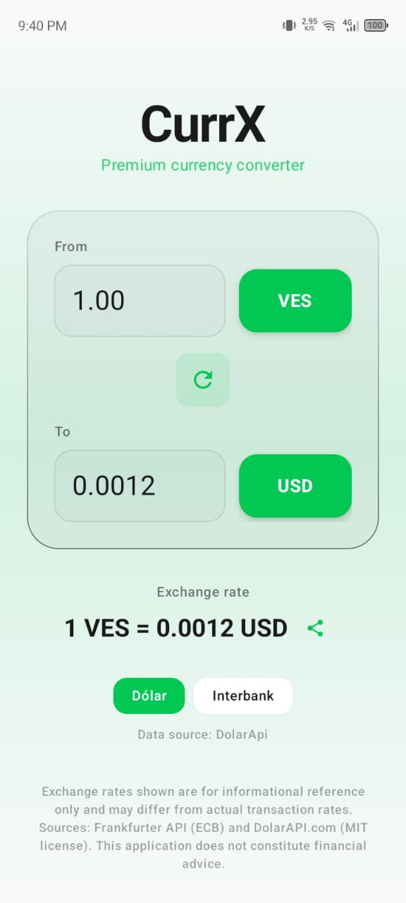
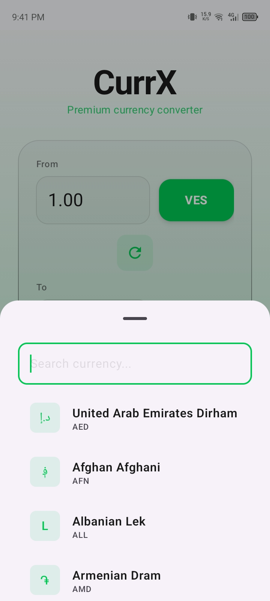
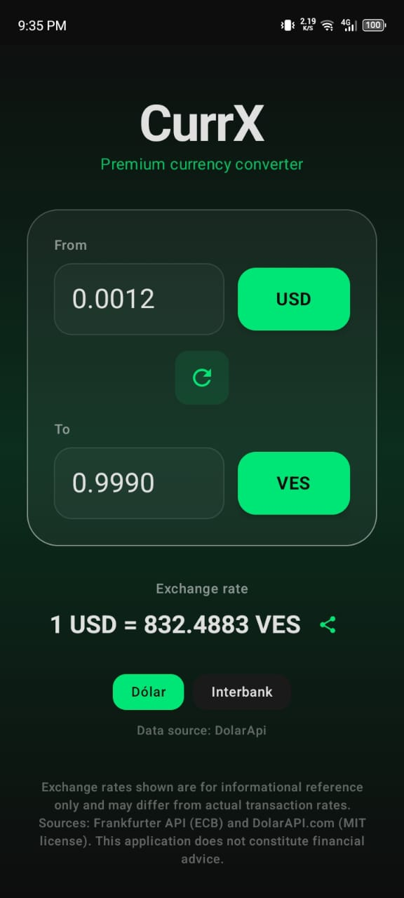

# CurrX — Fast & Simple Currency Converter


CurrX is a dual-API currency converter for Android built with **Jetpack Compose**. It provides real exchange rates for LATAM countries via [DolarAPI.com](https://dolarapi.com) and interbank rates via [Frankfurter API](https://www.frankfurter.dev), giving you both market and official rates side by side.


## Screenshots

|                     Home & conversion                     |                                 Currency picker                                 |                         Splash screen                         |                           Dark mode                            |
|:---------------------------------------------------------:|:-------------------------------------------------------------------------------:|:-------------------------------------------------------------:|:--------------------------------------------------------------:|
|  |  |  |  |


## Features

- **Dual-rate display** — Compare LATAM market rates with interbank (ECB) rates
- **18+ currencies** — All Frankfurter-supported currencies plus 8 LATAM currencies
- **LATAM coverage** — ARS, BOB, BRL, CLP, COP, MXN, UYU, VES (BCV official rate)
- **Rate selector** — Pick between available rate sources (market / interbank)
- **Currency search** — Instant filtering by name, code, or symbol in the picker sheet
- **Share rates** — One-tap share of the current rate via the Android share sheet
- **Swap currencies** — One-tap from/to inversion
- **i18n** — Fully localized in Spanish (default) and English, auto-detected from device locale
- **Custom branding** — Glassmorphism UI, custom green/black adaptive icon, and branded splash screen

## Getting Started

### Requirements

- Android Studio (latest stable)
- JDK 17+
- Android SDK 36

### Build & run

```bash
# Build a debug APK
./gradlew assembleDebug

# Install on a connected device/emulator
adb install app/build/outputs/apk/debug/app-debug.apk
```

Or open the project in Android Studio, let Gradle sync, and press **Run ▶**.

## Tech Stack

| Layer | Technology |
|-------|-----------|
| Language | Kotlin 2.1+ |
| UI | Jetpack Compose + Material 3 (glassmorphism styling) |
| Architecture | MVVM (ViewModel + StateFlow) |
| HTTP | OkHttp + Retrofit |
| Serialization | kotlinx.serialization |
| Navigation | ModalBottomSheet + AnimatedContent |
| i18n | Android resources (`values/` + `values-en/`) |

## Architecture

```
MainActivity            — Composable UI (Container/Presentational)
 └─ MainViewModel       — State management via StateFlow<MainUiState>
     └─ ExchangeRateRepository — Orchestrates API calls & rate selection
         └─ ExchangeRateApi    — Retrofit interface (dolarapi + Frankfurter)
             └─ CountryInterceptor — Routes X-Country headers to dolarapi subdomains
```

### Data flow

1. User selects `from` and `to` currencies
2. Repository checks if either currency is in the LATAM map
3. If yes: fetches LATAM rates from DolarAPI **plus** interbank rate from Frankfurter
4. If no: fetches only the interbank rate
5. ViewModel exposes both as `List<RateOption>`; UI renders a chip per option
6. User picks which rate to use, conversion updates in real time (with animated transitions)

### Networking details

- A single Retrofit instance plus a `CountryInterceptor` rewrites the request host to the correct dolarapi.com subdomain based on the `X-Country` header
- Frankfurter requests omit the header and hit the base URL (`api.frankfurter.dev`)
- No global naming strategy — Frankfurter's snake_case fields are mapped with explicit `@SerialName` annotations, keeping DolarAPI's camelCase payloads working out of the box

## APIs

### DolarAPI.com
- Provides **market rates** (compra/venta) for LATAM countries
- Each country is hosted on a subdomain (e.g., `cl.dolarapi.com`, `ve.dolarapi.com`)
- Support tiers: free, attribution required (MIT license)
- Documentation: [dolarapi.com/docs](https://dolarapi.com/docs)

### Frankfurter API
- Provides **European Central Bank reference rates** (interbank)
- Covers 30+ world currencies
- Free, no API key required
- Documentation: [frankfurter.dev](https://www.frankfurter.dev)

## Localization

The app ships with:

- **Spanish** — `app/src/main/res/values/strings.xml` (default/fallback)
- **English** — `app/src/main/res/values-en/strings.xml`

The device locale selects the language automatically; any unsupported locale falls back to Spanish. All user-facing strings live in `strings.xml` — no hardcoded UI text in code.

## License

<details>
<summary>MIT License</summary>

```
MIT License

Copyright (c) 2026 jsayago77

Permission is hereby granted, free of charge, to any person obtaining a copy
of this software and associated documentation files (the "Software"), to deal
in the Software without restriction, including without limitation the rights
to use, copy, modify, merge, publish, distribute, sublicense, and/or sell
copies of the Software, and to permit persons to whom the Software is
furnished to do so, subject to the following conditions:

The above copyright notice and this permission notice shall be included in all
copies or substantial portions of the Software.

THE SOFTWARE IS PROVIDED "AS IS", WITHOUT WARRANTY OF ANY KIND, EXPRESS OR
IMPLIED, INCLUDING BUT NOT LIMITED TO THE WARRANTIES OF MERCHANTABILITY,
FITNESS FOR A PARTICULAR PURPOSE AND NONINFRINGEMENT. IN NO EVENT SHALL THE
AUTHORS OR COPYRIGHT HOLDERS BE LIABLE FOR ANY CLAIM, DAMAGES OR OTHER
LIABILITY, WHETHER IN AN ACTION OF CONTRACT, TORT OR OTHERWISE, ARISING FROM,
OUT OF OR IN CONNECTION WITH THE SOFTWARE OR THE USE OR OTHER DEALINGS IN THE
SOFTWARE.
```
</details>

### Attribution

- **DolarAPI.com** — Rates provided under the [MIT license](https://dolarapi.com). See their site for full terms.
- **Frankfurter API** — Exchange rates provided by the European Central Bank via [frankfurter.dev](https://www.frankfurter.dev).

---

<div align="center">
  <sub>Built with ❤️ for LATAM</sub>
</div>